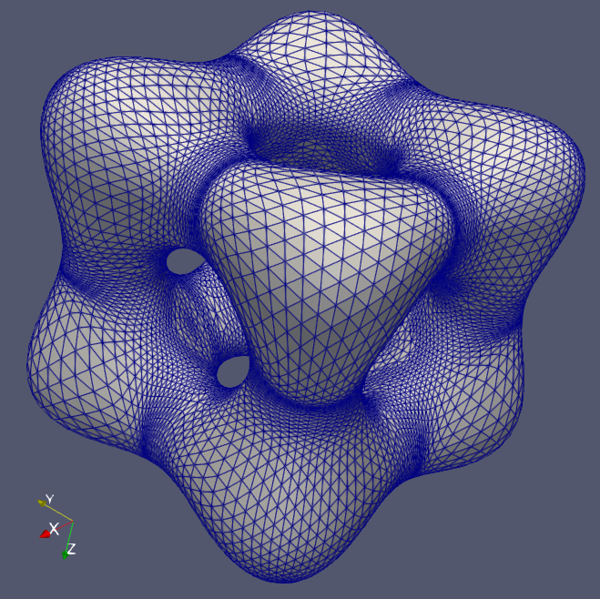
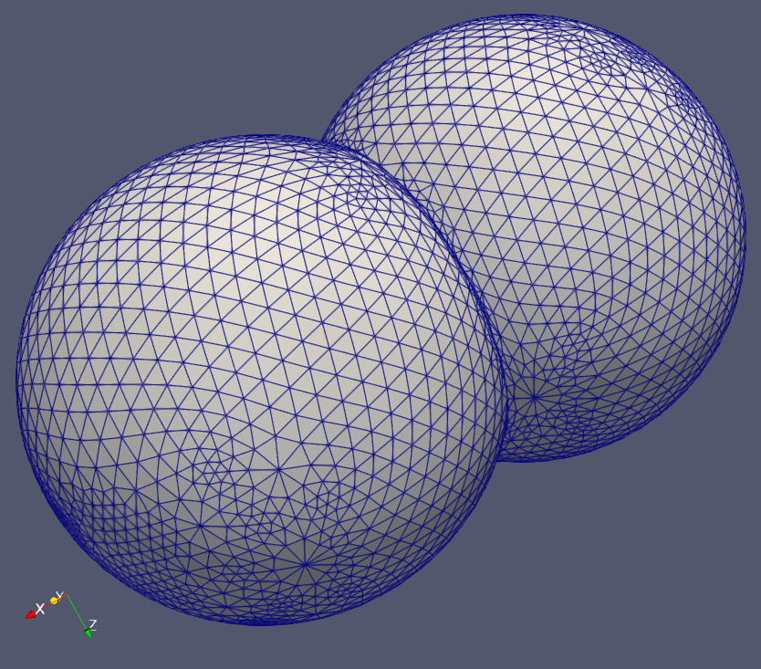
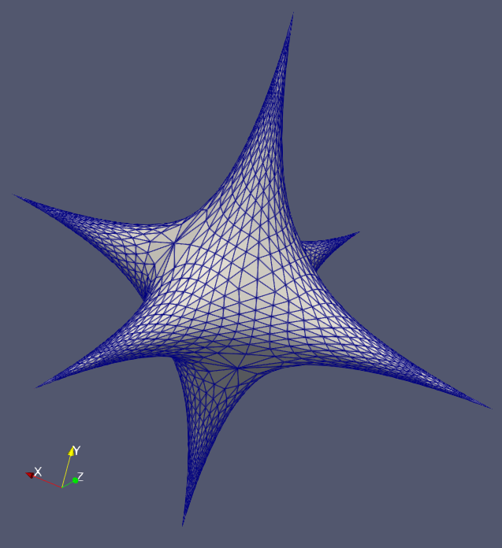

# Dual-Primal Mesh Optimization

As described in [Ohtake-Belyaev'02](https://doi.org/10.1145/566282.56630).

Uses [my geometry library](https://github.com/salvipeter/libgeom/),
but there is an `eigen` branch that uses only Eigen.

The test program uses different implicit meshers:

- [My dual contouring](https://github.com/salvipeter/dual-contouring)

- [My marching cubes](https://github.com/salvipeter/marching/)

- [The marching cubes of Agoston Sipos](https://github.com/agostonsipos/implici_marching_cubes/)

Example objects:

